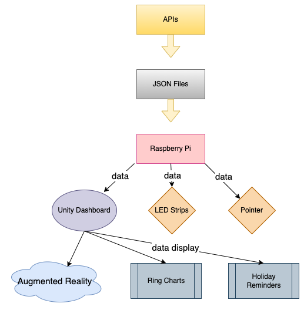

# Joy Timer: Term and Holiday Tracking Device  

## About Joy Timer✨
Joy Timer is a creative project designed to make tracking academic terms and holiday schedules easier and more engaging. Built as part of the CASA0019 module on **Sensor Data Visualization**, it combines a physical device with a digital dashboard and AR features to bring data to life. Whether you’re a student or simply curious about how time flies, Joy Timer gives you a clear and interactive way to stay organized.  

---

## What’s Inside✨

### The Dataset  
At the heart of Joy Timer are custom JSON files hosted on a Raspberry Pi. These files store:  
- Start and end dates for academic terms.  
- Holiday schedules for both China and the UK.  
- Real-time data to keep everything synced and up-to-date.  

### The Physical Device  
The physical setup is simple yet effective:  
- An **LED strip** gradually turns off lights as the academic term progresses, giving you a clear visual cue of how far you’ve come.  
- A **pointer** counts down to the next holiday, so you always know how long it is until your next break.  

### The Digital Dashboard  
The digital counterpart adds an extra layer of detail and functionality. Powered by Unity and synced with the Raspberry Pi, it offers:  
- **Ring charts** to visualize the remaining days in a term.  
- **Holiday reminders** for important dates in China and the UK.  
- Quick access to **academic module information**, so you’re always on top of what matters.  

### AR Magic  
What makes Joy Timer even more exciting is the AR feature. By overlaying interactive 3D models and additional data onto the physical device, it bridges the gap between the real and the virtual. Explore your term progress, adjust views, and dive deeper into the details—all in an intuitive, engaging way.  

---

## How It Works ✨
Joy Timer is powered by a mix of hardware and software that works seamlessly together:  
1. **Raspberry Pi** hosts the JSON data files and manages real-time syncing.  
2. **Physical components** like the LED strip and pointer provide an at-a-glance view of progress and holidays.  
3. **Digital dashboard** fetches data from the Raspberry Pi, presenting it in a clean, visual format.  
4. **AR integration** adds the final touch, giving users a rich, immersive experience.  

### System Architecture ✨
Below is a visual overview of how the different components of Joy Timer interact:  

  

---

## Meet the Team  
Joy Timer was created by our small but mighty team, Group JoyTimer:  
-	Hongbing Qiu   [@mk20661](https://github.com/mk20661)  
-	Jinming Xia    [@JINMING2333](https://github.com/JINMING2333)   
-	Zhiyu Cao      [@UCLcaozhiyu](https://github.com/UCLcaozhiyu)  
-	Yue Zhu        [@XLunaXX07](https://github.com/XLunaXX07)
-	
We worked together to design, build, and refine every part of the project, from hardware to AR visuals.  

---

## License  
This project is open-source and licensed under the MIT License.  

Want to see more? Check out our [GitHub repository](https://github.com/mk20661/SDV_Group_Assessignment).  
